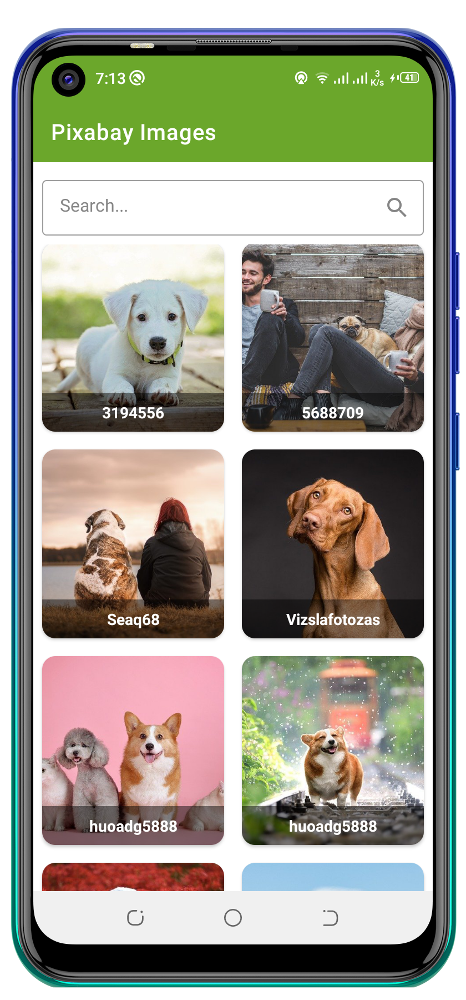
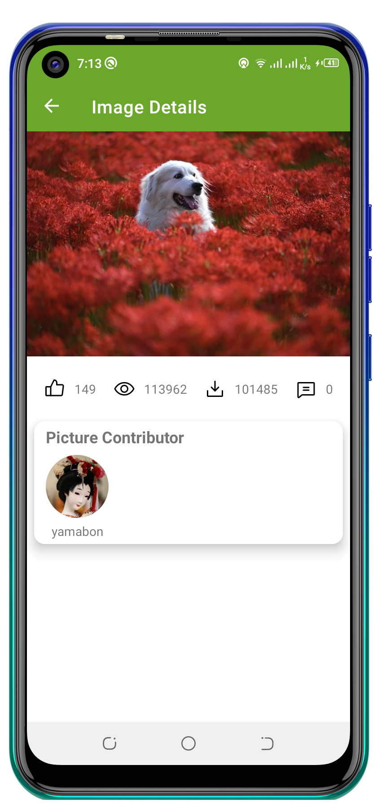

## AdanianAndroidTest

An android app built using Kotlin that consumes [Pixabay API](https://pixabay.com/api/docs/#api_search_images) to display images and their details. It has been built following Clean Architecture Principle, MVVM Architecture and Jetpack components.

> Download the apk [here](https://drive.google.com/file/d/1AkNYoby6kXTOnlSb_Uk43kyBurYlWTzY/view?usp=sharing)

## Architecture (Clean Architecture).
Clean Architecture combines a group of practices that produce systems with the following characteristics:
- Testable.
- UI-independent (the UI can easily be changed without changing the system).
- Independent of databases, frameworks, external agencies, and libraries.

The following scheme presents the architecture from the UI to the backend or database:

As you can see in the image, an Android application with Clean Architecture gathers the layers into three modules:
1. Presentation - presents data to a screen and handle user interactions.
     - Components:
       - Activities/ Fragments
       - ViewModels
       
2. Domain - which contains business logic
     - Components:
       - Models (Entities)
       - Usecases
       - Repositories Implementation
       
3. Data - which manages application data eg. retrieve data from the network, manage data cache.
     - Components:
       - Local data sources
       - Remote data sources
       - Repositories Interfaces
       
 ## Tech Stack.      
- [Kotlin](https://developer.android.com/kotlin) - Kotlin is a programming language that can run on JVM. Google has announced Kotlin as one of its officially supported programming languages in Android Studio; and the Android community is migrating at a pace from Java to Kotlin
- [Lifecycle](https://developer.android.com/topic/libraries/architecture/lifecycle) - Perform actions in response to a change in the lifecycle status of another component, such as activities and fragments.
- [Viewmodel](https://developer.android.com/topic/libraries/architecture/viewmodel) -The ViewModel class is designed to store and manage UI-related data in a lifecycle conscious way
- [LiveData](https://developer.android.com/topic/libraries/architecture/livedata) -  A lifecycle-aware data holder with the observer pattern
- [Kotlin Coroutines](https://developer.android.com/kotlin/coroutines) - A concurrency design pattern that you can use on Android to simplify code that executes asynchronously.
- [Room Database](https://developer.android.com/training/data-storage/room) - The Room persistence library provides an abstraction layer over SQLite to allow fluent database access while harnessing the full power of SQLite
- [View Binding](https://developer.android.com/topic/libraries/data-binding/) - Allows you to bind UI components in your layouts to data sources in your app using a declarative format rather than programmatically.
- [Retrofit](https://square.github.io/retrofit) -  Retrofit is a REST Client for Java and Android by Square inc under Apache 2.0 license. Its a simple network library that used for network transactions. By using this library we can seamlessly capture JSON response from web service/web API.
- [GSON](https://github.com/square/gson) - JSON Parser,used to parse requests on the data layer for Entities and understands Kotlin non-nullable and default parameters.
- [Flow](https://developer.android.com/kotlin/flow) - In coroutines, a flow is a type that can emit multiple values sequentially, as opposed to suspend functions that return only a single value.
- [Hilt](https://developer.android.com/training/dependency-injection/hilt-android) -  A dependency injection library for Android that reduces the boilerplate of doing manual dependency injection in your project
- [Navigation Components](https://developer.android.com/guide/navigation/navigation-getting-started) -  Helps you implement navigation, from simple button clicks to more complex patterns, such as app bars and the navigation drawer.
- [Logging Interceptor](https://github.com/square/okhttp/blob/master/okhttp-logging-interceptor/README.md) -  logs HTTP request and response data.
- [Material Libarary](https://material.io/develop/android) -  Modular and customizable Material Design UI components for Android
- [Glide](https://github.com/bumptech/glide)- An image loading and caching library for Android focused on smooth scrolling.
- [SavedStateHandle](https://developer.android.com/guide/navigation/navigation-programmatic) - Getting results from a destination when navigating from one fragment to another.
- [MockWebServer](https://github.com/square/okhttp/tree/master/mockwebserver) -  A mock web server is a program that mocks the behavior of an actual remote server but doesn’t make calls over the internet. 
- [JUnit](https://junit.org/junit4/) - JUnit is a simple framework to write repeatable tests. It is an instance of the xUnit architecture for unit testing frameworks.
- [Espresso](https://developer.android.com/training/testing/espresso) - write concise, beautiful, and reliable Android UI tests.

## Pixabay API
Sign up for the API key  on the following Link https://pixabay.com/api/docs/#api_search_images

## Screenshots
These are the app's screenshots:

## Demo
https://user-images.githubusercontent.com/50293753/146123203-388bfed6-7cef-42e1-8ca9-8650630780da.mp4
